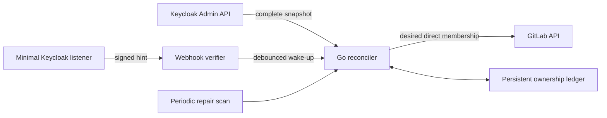

# Architecture

GroupBridge is an external desired-state controller. Keycloak is the source, rules
select source groups, and compiled-in target providers translate direct membership into
the target's native API.

## Invariants

- Event bodies never authorize changes. They only wake the reconciler.
- A failed or partial Keycloak snapshot produces no target changes.
- Additions and role increases happen before removals.
- Only direct GitLab membership is read, changed, or pruned.
- Owners, the current token user, custom-role users, and configured protected users are
  never removed or downgraded.
- Every delete disables GitLab's descendant-resource cascade.
- Group deletion is outside the v1 capability set.
- `managed-only` prune removes only ledger-owned memberships.
- A target-path collision fails before any provider mutation.
- A missing membership must be seen in two complete snapshots before deletion.
- Deleted or moved source groups are reconciled through persisted mapping tombstones.

## Provider boundary

The Go `provider.Provider` interface exposes a name, health check, and `SyncGroup`.
Provider-neutral requests contain source group IDs, members, target path, desired role,
identity methods, and safety policy. Provider implementations own native API details.
They are compiled into the binary through an explicit registry—there is no dynamic code
loading or Go plugin ABI.

The next provider should first be implemented against the narrow interface. If its
native model is not group membership (Vault group aliases are the obvious example), add
a new capability interface instead of making it pretend to be GitLab.

## State and availability

The first release uses an atomically replaced JSON ownership ledger on a PVC. It is
deliberately single-writer and the chart fixes the operational model at one replica.
Webhook hints are lossy; the periodic full scan is the durability mechanism.

The multi-replica design boundary is a PostgreSQL-backed dirty-key queue and ownership
store with row locking. Webhook receivers and workers can then be active-active while a
lease or database advisory lock elects one periodic scanner. That feature must land
before raising the chart replica count.

## Identity

Stable numeric/opaque IDs are canonical inside each system. Group paths and usernames
are mutable locators. The preferred cross-system join is Keycloak user ID to GitLab OIDC
external UID. Username and email modes exist only for compatibility with aligned legacy
accounts.
