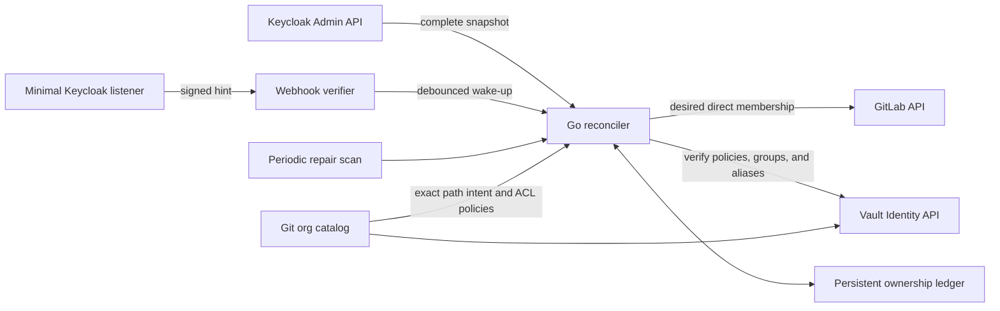

# Architecture

GroupBridge is an external desired-state controller. Keycloak is the source, rules
select source groups, and compiled-in target providers translate direct membership into
the target's native API.

```mermaid
flowchart LR
  KC["Keycloak Admin API"] -->|"complete snapshot"| R["Go reconciler"]
  SPI["Minimal Keycloak listener"] -->|"signed hint"| WH["Webhook verifier"]
  WH -->|"debounced wake-up"| R
  TIMER["Periodic repair scan"] --> R
  R -->|"desired direct membership"| GL["GitLab API"]
  R -->|"verify policies, groups, and aliases"| VAULT["Vault Identity API"]
  GIT["Git org catalog"] -->|"exact path intent and ACL policies"| R
  GIT --> VAULT
  R <--> LEDGER["Persistent ownership ledger"]
```

## Invariants

- Event bodies never authorize changes. They only wake the reconciler.
- A failed or partial Keycloak snapshot produces no target changes.
- Additions and role increases happen before removals.
- Only direct GitLab membership is read, changed, or pruned.
- Owners, the current token user, custom-role users, and configured protected users are
  never removed or downgraded.
- Every delete disables GitLab's descendant-resource cascade.
- Group deletion is outside the v1 capability set.
- `managed-only` prune removes only ledger-owned memberships.
- A target-path collision fails before any provider mutation.
- A missing membership must be seen in two complete snapshots before deletion.
- Deleted or moved source groups are reconciled through persisted mapping tombstones.
- Exact `sourceGroupPaths` distinguish a temporary Keycloak rebuild from an intentional
  Git removal. Canonical full paths, not recreated Keycloak UUIDs, own declared targets.
- Vault reconciliation never provisions users, reads secret data, writes ACL policies,
  or deletes identity objects.

## Provider boundary

The common `provider.Provider` interface exposes only a name and health check.
`GroupSyncProvider` handles GitLab-style direct membership, while `AccessProvider`
handles Vault-style claim-backed access without target user provisioning. Providers are
compiled into the binary through an explicit registry—there is no dynamic code loading
or Go plugin ABI.

Vault ACL policies and the KV v2 mount are GitOps-owned. The provider derives the exact
expected name and HCL, then verifies the external identity group and exact Keycloak
full-path OIDC group alias that VCO/Argo created. VCO/Argo owns creation, updates, and
deletion from the same Git organization catalog; GroupBridge only verifies exact live
state.

## State and availability

The first release uses an atomically replaced JSON ownership ledger on a PVC. It is
deliberately single-writer and the chart fixes the operational model at one replica.
Webhook hints are lossy; the periodic full scan is the durability mechanism.

The multi-replica design boundary is a PostgreSQL-backed dirty-key queue and ownership
store with row locking. Webhook receivers and workers can then be active-active while a
lease or database advisory lock elects one periodic scanner. That feature must land
before raising the chart replica count.

## Identity

For GitOps-declared rules, canonical full paths are durable organization identities and
Keycloak UUIDs are runtime correlation only. This permits a complete Keycloak rebuild
without embedding generated UUIDs in Git. The preferred GitLab user join remains
Keycloak user ID to GitLab OIDC external UID. Vault instead maps each direct, full
Keycloak group path from the dedicated `vault_groups` claim to an external-group alias
during OIDC login. Direct full paths avoid the parent-role inheritance that would
otherwise over-grant nested organizations.
